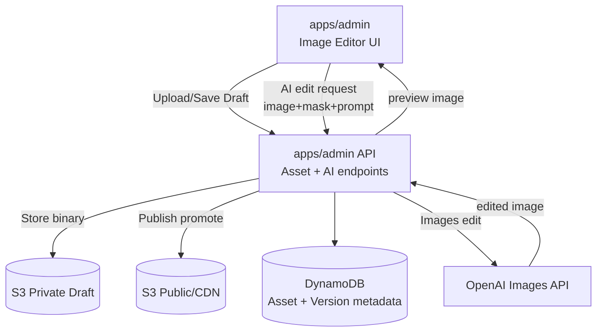

# Playmasters Image Editor Architecture

## 1) Purpose and Scope

### Purpose

Provide an **in-admin image editor** to create and modify:

* Level backgrounds
* Splash screens
* UI art (banners, badges)
* (Later) sprite sheets and individual sprites

### Scope

* Pixel-level manual editing (core requirement)
* AI-assisted editing via text instructions (OpenAI integration)
* Asset lifecycle: **Draft → Publish → Rollback**
* Works well for **low-resolution retro art** (e.g., 16×16 sprites, 256×224 backgrounds)
* “Standalone” tool: accessible from admin navigation, not tied to a specific game page

### Non-goals

* Full commercial-grade layer system (we can add lightweight layers later)
* Complex vector editing
* Pro photo retouching workflows

---

## 2) User Flows

### Flow A — Create / Upload

1. Admin opens **Image Editor** from admin nav
2. Upload image (PNG/WebP/JPG; sprites typically PNG)
3. Editor opens image on canvas
4. Admin edits manually or uses AI prompt
5. Save as Draft

### Flow B — AI-assisted edit

1. Select region (mask) or choose “whole image”
2. Type instruction (e.g., “Convert this background to a neon arcade space theme”)
3. Send to OpenAI images edit endpoint
4. Receive result and preview
5. Accept → becomes new draft version

OpenAI supports image edits with a prompt and optional mask. ([platform.openai.com][1])

### Flow C — Publish and use elsewhere

1. Publish draft → generates immutable version
2. Asset becomes selectable from:

   * background catalog
   * splash screens
   * game metadata
   * level configs

### Flow D — Rollback

1. View versions
2. Set “Published” pointer back to previous version

---

## 3) Component Architecture

## 3.1 Admin App UI (apps/admin)

Routes:

* `/editor` (landing)
* `/editor/images` (asset list)
* `/editor/images/new` (upload)
* `/editor/images/:assetId` (edit + versions)

Navigation:

* Add “Image Editor” link in admin sidebar/top nav.

UI Modules:

* **Asset Library Panel**
* **Canvas Editor**
* **Toolbox**
* **History/Undo**
* **AI Prompt Panel**
* **Version & Publish Panel**

---

## 3.2 Canvas Editing Engine (Client-Side)

### Recommended implementation: HTML Canvas + ImageData

* Load image → draw to `<canvas>`
* Maintain a working `ImageData` buffer for pixel operations
* Tools operate directly on pixels for predictable retro output

Core tools (MVP):

* Pencil (1px and configurable brush size)
* Eraser
* Fill (bucket)
* Color picker
* Palette strip (optional but highly recommended for retro art)
* Rect selection / lasso selection (MVP: rect)
* Move selection (optional)
* Grid overlay toggle (essential for sprites)

Undo/redo:

* Store diffs (small images) OR snapshots every N steps
* For large images, snapshot throttling (every 1–2 seconds or on tool-up)

Performance approach:

* Work in a **scaled viewport**, but edits apply to the native resolution
* Use nearest-neighbor scaling for crisp pixel art

---

## 3.3 OpenAI Integration (Server-Side)

### Key security requirement

Never call OpenAI directly from the browser. OpenAI recommends keeping API keys out of client-side environments. ([OpenAI Help Center][2])

So:

* Admin UI sends image + mask + prompt to your backend route
* Backend route calls OpenAI Images API
* Backend returns the resulting image to the client for preview

OpenAI provides an Images endpoint that can create edited images from an input image with an optional mask. ([platform.openai.com][1])

**Admin API route (in apps/admin)**

* `POST /api/image-edit`

  * input: original image, optional mask PNG, instruction prompt
  * output: edited image (base64 or signed URL)

Also account for rate limits (design for backoff/retry and user feedback). ([platform.openai.com][3])

---

## 4) Data Model and Storage

### 4.1 Assets in Object Storage

Use S3 (or compatible) for image binaries:

* Draft assets stored privately
* Published assets stored publicly behind CDN (or public bucket + CDN)

### 4.2 Metadata in DynamoDB

Use Dynamo for:

* Asset identity
* Version pointers
* Audit trail
* Tags/usage

**ImageAsset**

* assetId (UUID)
* type: `background | sprite | splash | ui`
* title
* tags[]
* width/height
* createdAt/updatedAt
* currentDraftVersionId
* currentPublishedVersionId

**ImageAssetVersion**

* versionId
* assetId
* state: Draft | Published | Archived
* storageKey (S3 key)
* createdBy
* createdAt
* changeNotes
* derivedFromVersionId (for AI edits)

---

## 5) Pixel-Level Editing Requirements

To meet “sprites later” needs, the editor must support:

* Native resolution editing (no “blurry” resampling)
* Nearest-neighbor scaling in UI
* Optional grid overlay at integer pixels
* Palette support (fixed limited colors, e.g., 16–64 colors)
* Export as PNG with transparency preserved

AI edits must preserve pixel art style:

* Provide an “AI Style” dropdown:

  * “Pixel Art / Retro”
  * “Minimal changes”
  * “Modern / Detailed”
* Default to “Pixel Art / Retro”

---

## 6) AI Edit Modes

### Mode 1 — Whole-image transform

* Use prompt only (no mask)
* Example: “Turn this into a neon purple space background, pixel art, 256×224”

### Mode 2 — Masked edit (recommended)

* Admin selects region
* Editor generates mask PNG:

  * white = editable region
  * black/transparent = locked region
* Send mask with prompt to OpenAI edits endpoint

OpenAI’s image edits support masks applied to the first image, using a valid PNG with size constraints. ([platform.openai.com][1])

### Mode 3 — Variants (optional later)

* “Generate 3 alternatives”
* Choose best → becomes draft

---

## 7) Validation, Guardrails, and Best Practices

### Input validation

* File type and maximum size checks
* Enforce max dimensions per asset type:

  * Sprite: <= 1024×1024 (usually far smaller)
  * Background: <= 4096×4096 (configurable)

### Output validation

* Ensure output image matches expected dimensions unless explicitly allowed
* Ensure alpha channel preserved if required (sprites)

### Audit and safety

* Store who edited what, and when
* Require change notes on publish
* Make rollback one click

### Environments

* Dev/stage/prod separation for assets and pointers

---

## 8) Deployment and Security

### Separate admin origin

* Admin app deployed separately from public app (already your plan)
* Strict auth + admin allowlist/RBAC
* API routes restricted to admin users

### Secret management

* OpenAI API key stored server-side only
* Never exposed to client
* Add rate limiting on `/api/image-edit` to prevent abuse

OpenAI production best practices emphasize key security and safe deployment patterns. ([platform.openai.com][4])

---

## 9) Integration Points with the Rest of Playmasters

### Background catalog

* Published `ImageAsset` of type `background` appears in background picker in Level Editor

### Game metadata

* Published `splash`/`logo` assets selectable

### Sprites (later)

* Same editor can open sprite sheets and single sprites
* Later add sprite-sheet slicing and hitbox overlay as a new tool mode

---

## 10) MVP Feature List

### Must-have (MVP)

* Upload image (PNG/JPG/WebP)
* Pixel canvas editor:

  * pencil, eraser, fill, picker
  * grid overlay
  * zoom
* Rect selection + mask generation
* AI prompt panel:

  * whole-image edit
  * masked edit
* Save Draft versions
* Publish + rollback
* Asset library list with search/filter by type

### Nice-to-have (v1.1)

* Palette management (import/export palettes)
* Dithering tool
* Sprite-sheet slicing
* Background parallax preview
* “Optimize for pixel art” AI prompt templates

---

## 11) Diagram

OpenAI image editing is performed via the Images API and should be called server-side to protect keys. ([platform.openai.com][1])

---

## 12) Implementation Roadmap (Short)

1. **Asset library + upload + versioning (no editor yet)**
2. **Canvas pixel editor MVP (pencil/eraser/fill/picker + undo)**
3. **Selection + mask generation**
4. **OpenAI integration endpoint + prompt UI**
5. **Publish workflow + rollback**
6. **Background catalog integration**
7. **Sprite enhancements later (sheet slicing, hitbox tool)**

