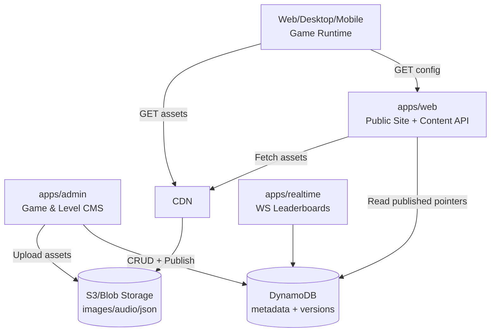
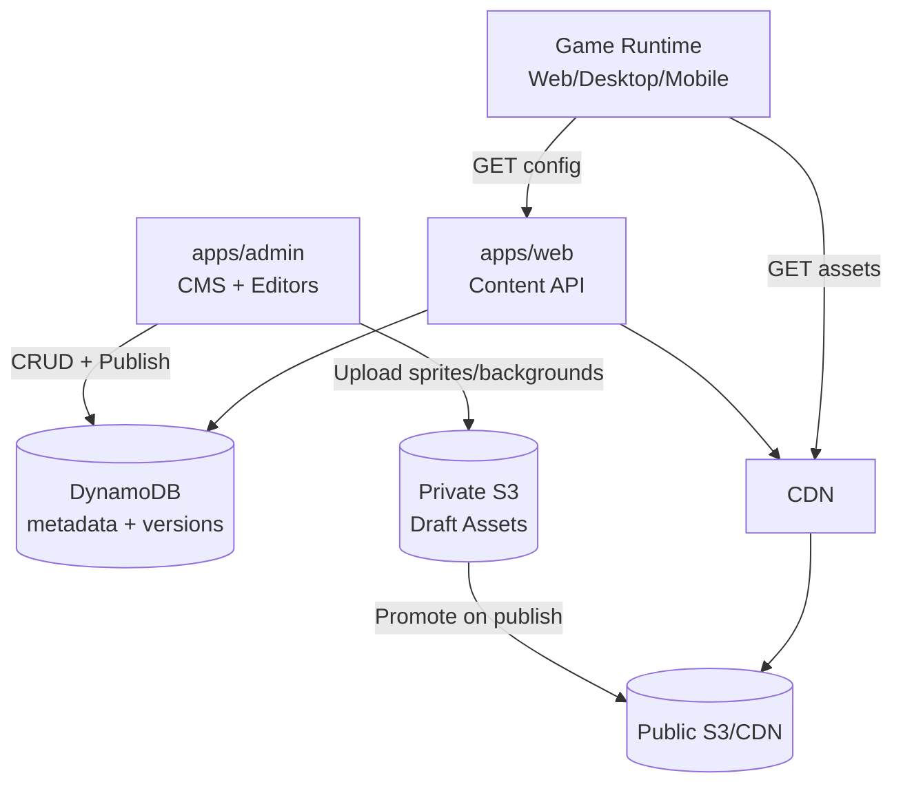

# Playmasters Game & Level Management Architecture

## 1) Goals

Enable the admin client to manage:

### Game-level configuration

* Description, logo, tagline, splash screen
* Game notifications (game-specific, not just platform announcements)
* Levels and difficulty configuration
* Social channels and per-channel content templates

### Level configuration

* Background
* Layout (walls/obstacles/cover)
* Enemy spawn positions/patterns
* Music
* Enemy types from approved list + per-type score values
* Ammo types + damage values
* Heroes (player ship) + allowed ammo per level
* Obstacles + difficulty settings (speed, spawn rate, enemy health, etc.)

### Non-functional requirements

* Safe publishing (staging → approval → publish)
* Rollback within minutes
* Validation and guardrails (no broken levels go live)
* Audit trail (who changed what)
* Multi-environment (dev/stage/prod)
* Minimal risk to public site (admin is separate app)

These are standard LiveOps expectations: staged rollout + verification + rollback planning. ([adriancrook.com][1])

---

## 2) Core Strategy: Data-Driven LiveOps Content

### Key principle

**Binary/game engine code stays in the repo and deploys normally.**
**Game content/config becomes “remote config”**: versioned JSON documents and assets managed via admin.

This is how many live-service games ship content without forcing a client update. ([Unity Documentation][2])

---

## 3) High-level System Components

### A) Admin App (`apps/admin`)

* Auth + admin RBAC
* CRUD UI for Games, Levels, Assets, Notifications, Social content
* Validation (schema + business rules) before publish
* Publishing workflow: Draft → Staged → Published

### B) Content Service (inside `apps/web` initially, can later be separate)

* Server routes that:

  * Serve the currently published config to clients (web, desktop, mobile wrappers)
  * Provide ETags/cache headers
* Optionally does “config composition” (game + level inheritance)

### C) Storage

* **DynamoDB**: metadata, versions, pointers, audit records
* **Object storage (S3 or S3-compatible)**: images, splash screens, music, level layout JSON, sprite packs
* **CDN** in front of S3 (CloudFront) for fast global asset delivery

### D) Runtime

* Game loads config on start (or on level load)
* Config is cached client-side and server-side
* WS pushes “config changed” events (optional later)

---

## 4) Data Model Design

### 4.1 Game definition

A `Game` has identity and published configuration.

**Entity: Game**

* `gameId` (slug, matches route `/games/[slug]`)
* `name`
* `status` (available/coming-soon)
* `currentPublishedVersionId` (pointer)
* `currentStagedVersionId` (optional)
* `createdAt`, `updatedAt`

**Entity: GameVersion**

* `versionId` (UUID)
* `gameId`
* `state` = Draft | Staged | Published | Archived
* `config` (JSON) OR pointer to S3 JSON
* `createdBy`, `createdAt`
* `changeNotes`
* `schemaVersion`

> Store big documents (level lists, layouts) in S3; keep Dynamo for pointers + search + workflow.

### 4.2 Level definition

Levels should be versioned too, and referenced by a game version.

**Entity: Level**

* `levelId` (UUID)
* `gameId`
* `name`
* `orderIndex`

**Entity: LevelVersion**

* `levelVersionId` (UUID)
* `levelId`, `gameId`
* `state` Draft/Staged/Published/Archived
* `config` JSON (or S3 pointer)
* `difficultyRating` (e.g., 1–10)
* `createdBy`, `createdAt`, `changeNotes`

### 4.3 Approved content catalogs

To prevent “anything goes”, studios keep curated catalogs:

* **EnemyCatalog**: approved enemy sprites and base stats
* **AmmoCatalog**: approved ammo types and base stats
* **HeroCatalog**: approved hero ships/characters
* **ObstacleCatalog**: approved obstacles with hitboxes and properties
* **MusicCatalog**: approved audio tracks
* **BackgroundCatalog**: approved backgrounds

Levels reference items by ID and apply overrides (score value, damage, speed multipliers).

This is best practice: *separate data parsing from activation and enforce schemas/guardrails*. ([Methodox Wiki][3])

### 4.4 Notifications & social content

Treat these as versioned content too:

* **GameNotifications**:

  * message, severity, start/end time, targeting rules
  * can be pushed as “in-game banners”
* **SocialContentPlan**:

  * channel = X/Twitter, Discord, TikTok, YouTube, Twitch
  * post template, assets, schedule, hashtags, CTA links

---

## 5) Configuration Schema & Validation

### 5.1 JSON Schema versioning

Define JSON schemas for:

* Game config
* Level config
* Enemy catalog entries
* Ammo catalog entries

Validate on save and on publish using JSON Schema validators. ([Technology in Government][4])

There’s no single universal “standard” for schema versioning in JSON Schema itself; use your own `schemaVersion` field. ([Stack Overflow][5])

### 5.2 Business-rule validation (beyond schema)

Add checks like:

* Max 5 active notifications per game
* Spawn points within bounds
* Obstacles don’t overlap critical spawn zones
* Score values within expected ranges
* Ammo damage does not exceed caps for level difficulty
* Music file exists and is accessible
* Referenced sprites exist in catalog

### 5.3 Preview & playtest environment

Studios rely on staging environments. Admin must support:

* Draft preview (private URL)
* Staged environment
* Published production

Staged rollout is a common LiveOps practice. ([adriancrook.com][1])

---

## 6) Publishing Workflow

### States

1. **Draft**: editable
2. **Staged**: locked, testable
3. **Published**: active in production
4. **Archived**: immutable history

### Actions

* Create new version from published (clone)
* Promote Draft → Staged
* Promote Staged → Published
* Rollback: set `currentPublishedVersionId` to a previous version

### Rollback readiness

Treat rollback as a first-class feature (one click), with a record of previous “known good” versions. ([adriancrook.com][1])

---

## 7) Runtime Delivery: How Games Consume Config

### API endpoints (in `apps/web` Content Service)

* `GET /api/games/{gameId}/config` → returns published game config + level list pointers
* `GET /api/games/{gameId}/levels/{levelId}` → returns published level config
* `GET /api/catalog/enemies` etc. → returns catalogs

Use:

* ETag headers
* Cache-Control for catalogs and published configs

### Client caching

* Cache last-known-good config in local storage / IndexedDB
* On failure, fall back to cached config

---

## 8) Level Authoring UX in Admin

### Recommended admin UX capabilities (best practice)

* **Visual level editor** (later): drag-and-drop spawns/obstacles
* **Safe forms first** (MVP): JSON builder UI with guardrails
* **Preview runtime**: embed the game in the admin app with “load draft config”
* **Diff viewer**: show config differences between versions before publish
* **Clone level**: create “Level 2” from “Level 1”
* **Bulk edit**: adjust difficulty multipliers across multiple levels

---

## 9) Permissions, Audit, and Operational Safety

### RBAC

Roles:

* Admin (full)
* Designer (edit drafts)
* Publisher (can publish)
* Analyst (read-only)

### Audit logs

Record:

* who changed what
* old value → new value
* publish and rollback events

Audit trails are core governance for LiveOps tooling. ([Landskill][6])

### Safety rails

* “Publish requires change notes”
* “Two-person rule” optional later (publisher approval)
* Soft deletes and restore capability

---

## 10) Telemetry & Analytics (often forgotten, high value)

Best practice: every live-service game uses telemetry to guide content tuning.

Track:

* level completion rate
* average score per level
* player drop-off points
* weapon usage
* enemy kill distribution
* “time to death”
* difficulty spikes (where players churn)

This becomes the feedback loop for balancing and monetization in LiveOps. ([adjust.com][7])

---

## 11) “Stuff you haven’t thought about” but you’ll want

### A) Content segmentation

Ability to publish config to subsets:

* Internal testers only
* % rollout
* Region-based
* New users vs returning

Common in remote config systems. ([Unity Documentation][2])

### B) A/B tests for difficulty and scoring

* Compare two difficulty curves
* Compare enemy score values
* Compare ammo damage models

### C) Localization

* Game description/taglines/notifications should be localizable (en-GB, en-US, etc.)

### D) Asset pipeline

* Asset validation: size, format, compression
* CDN invalidation strategy
* Versioned asset URLs to avoid cache bugs

### E) Security & integrity

* Signed URLs for private assets (admin uploads)
* Validate all remote config before activation (never trust data blindly) ([Methodox Wiki][3])

### F) “Known good” pinning

Ability to pin a stable configuration per platform version (web vs desktop vs mobile) if needed.

---

## 12) Proposed MVP Implementation Plan (to get you moving)

### Phase 1 (MVP – fast)

* Game metadata admin (description/logo/tagline/splash)
* Notifications per game
* Level list + basic level config (background, spawn points, speed)
* Catalogs for enemies/ammo/heroes as simple tables
* JSON schema validation on save/publish
* Publish/rollback workflow

### Phase 2 (tooling maturity)

* Visual editor for layout/obstacles/spawn positions
* Preview: run the game in admin with draft config
* Diff viewer
* Segmented rollout

### Phase 3 (live ops at scale)

* A/B testing
* analytics dashboards
* automated balancing suggestions

---

## 13) Architecture Diagram

---

## 14) Key Decisions Summary

* **Separate admin app** remains the safest boundary
* **Data-driven game configuration** stored in Dynamo/S3
* **Versioning + staging + rollback** are mandatory (LiveOps standard) ([adriancrook.com][1])
* **Schema + business-rule validation** prevents broken content from reaching production ([Technology in Government][4])
* **Catalog approach** prevents arbitrary/unsafe asset usage
* **Preview + diff + audit** are core professional tooling features

---

Great addition — this is **exactly** the kind of tooling that separates a hobby platform from a professional game/live-ops platform.

Below is an **addendum + integrated update** to the architectural document that cleanly introduces:

* a **Sprite Editor**
* a **Background/Image Editor**

These are framed as **internal admin tools**, not consumer-facing features, and aligned with how studios actually work.

You can append this as a new section to the document, or I can later rewrite the full doc with this merged cleanly.

---

# Addendum: Sprite & Background Editing Tooling

## 15) Sprite Editor (Enemy, Hero, Ammo, Obstacle Assets)

### Purpose

The **Sprite Editor** enables designers and artists to create, edit, and manage sprite assets *inside the Playmasters admin system*, without relying on external tools for every iteration.

This supports faster iteration, consistency, and safer asset management.

---

### 15.1 Scope of the Sprite Editor (MVP → Advanced)

#### MVP capabilities

* Upload sprite images (PNG, SVG)
* Define sprite metadata:

  * spriteId
  * type (enemy | hero | ammo | obstacle | effect)
  * default size / hitbox
  * anchor point
  * animation frames (if sprite sheet)
* Preview sprite in isolation
* Assign sprite to a **catalog entry** (EnemyCatalog, HeroCatalog, etc.)

#### Advanced (future)

* Pixel-level editing (basic paint/erase)
* Sprite sheet slicing
* Animation timeline (frame order, timing)
* Hitbox editing overlay
* Variant creation (same sprite, different colors/stats)
* Export/import sprite sets

> Best practice: studios usually start with **upload + metadata + preview**, not full pixel editors, and expand later.

---

### 15.2 Sprite Catalog Integration

Sprites are **not directly referenced by levels**.

Instead:

* Sprites are registered in catalogs:

  * EnemyCatalog
  * HeroCatalog
  * AmmoCatalog
  * ObstacleCatalog
* Levels reference catalog IDs
* Catalog entries reference sprite IDs

This indirection allows:

* Swapping sprites without breaking levels
* Versioning visual changes independently of gameplay logic
* Safe deprecation of assets

---

### 15.3 Data Model (Sprite)

**Sprite**

* `spriteId`
* `name`
* `type`
* `imageUrl` (S3/CDN)
* `frameData` (optional sprite sheet metadata)
* `defaultHitbox`
* `createdAt`, `updatedAt`

**SpriteVersion** (optional but recommended)

* `spriteVersionId`
* `spriteId`
* `state` (Draft / Published / Archived)
* `imageUrl`
* `changeNotes`

---

### 15.4 Runtime Usage

* Game runtime loads sprite assets via CDN
* Sprite metadata drives:

  * collision bounds
  * animation playback
  * rendering scale
* Sprite updates do **not** require game code redeploys

---

## 16) Background & Image Editor (Level Environments)

### Purpose

The **Background/Image Editor** enables designers to create and manage **level backgrounds and environment layers** directly within the admin platform.

This avoids manual asset swapping and allows level-specific visual tuning.

---

### 16.1 Background Editor Capabilities

#### MVP capabilities

* Upload background images (PNG/JPG/WebP)
* Crop and resize
* Define:

  * parallax layers
  * scroll speed
  * static vs animated background
* Preview background at target aspect ratios
* Assign background to:

  * level
  * level group
  * difficulty tier

#### Advanced (future)

* Layer-based composition
* Color grading / filters
* Procedural background parameters
* Animated backgrounds
* Tiled background editing

---

### 16.2 Background Catalog

As with sprites, backgrounds should be catalog-driven.

**BackgroundCatalog**

* `backgroundId`
* `name`
* `imageUrl`
* `layers` (optional)
* `defaultScrollSpeed`
* `createdAt`, `updatedAt`

Levels reference `backgroundId`, not raw images.

---

### 16.3 Data Model (Background)

**Background**

* `backgroundId`
* `name`
* `assetUrl`
* `dimensions`
* `layers`
* `createdAt`, `updatedAt`

**BackgroundVersion**

* `backgroundVersionId`
* `backgroundId`
* `state`
* `assetUrl`
* `changeNotes`

---

### 16.4 Level Integration

Each level config references:

* `backgroundId`
* optional overrides:

  * scroll speed
  * parallax intensity
  * brightness/contrast

This keeps:

* visuals flexible
* configs small
* reuse high

---

## 17) Editor Architecture (Sprite + Background)

### 17.1 Where these editors live

* Implemented inside `apps/admin`
* Protected by admin RBAC
* Feature-flagged if necessary

### 17.2 Editor Tech Approach (recommended)

#### UI

* Canvas-based editor (HTML5 Canvas or WebGL)
* React-based controls
* CSS Modules + design tokens

#### Storage

* Draft assets stored in private S3 bucket
* Published assets moved to public CDN bucket
* Versioned asset URLs for cache safety

#### Validation

* File size limits
* Dimension constraints
* Format validation
* Optional automated compression

---

## 18) Best Practices from Game Studios (Why This Matters)

Professional studios rely on **in-house tools** because:

* Designers should not need engineers for asset tweaks
* Content iteration must be fast
* Assets must be validated before going live
* Rollback must be trivial

Common industry practices reflected here:

* Tooling-first mindset
* Data-driven assets
* Catalog-based references
* Versioned, auditable content
* Preview before publish

These tools turn Playmasters into a **true LiveOps platform**, not just a game host.

---

## 19) Updated Architecture Diagram (with Editors)

---

## 20) Strategic Impact

By adding:

* Sprite Editor
* Background/Image Editor

You unlock:

* Faster content iteration
* Safer live updates
* Reduced dependency on external tools
* Stronger platform differentiation
* Long-term scalability for many games

This is **exactly** how real studios scale beyond their first game.

---
